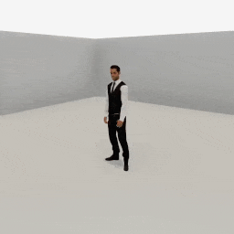
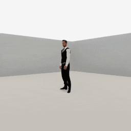

##### Replicants

# Arm articulation, pt. 2: Grasp and drop objects

*Replicant arm articulation is a complex topic. [Part 1](arm_articulation_1.md) covers basic arm articulation actions. This document covers grasping and dropping. [Part 3](arm_articulation_3.md) covers more advanced examples that use some additional optional parameters. [Part 4](arm_articulation_4.md) describes a relatively complex use-case: stacking objects on top of each other.*

The Replicant can grasp and drop objects. Each hand can grasp exactly one object at a time.

## The `grasp(target, arm)` action

`grasp(target, arm)` will tell the Replicant to grasp an object. **This is a non-physics, non-motion action. The Replicant WILL NOT bend its arm towards the target.** To properly grasp, first call [`reach_for(target, arm)`](arm_articulation_1.md), *then* `grasp(target, arm)`.

When a Replicant grasps an object, the object becomes kinematic and continuously tracks the Replicant's hand. If the object [contains other objects](../semantic_states/containment.md), those objects will also become kinematic and will be parented to the root grasped object:

```python
from tdw.controller import Controller
from tdw.tdw_utils import TDWUtils
from tdw.add_ons.replicant import Replicant
from tdw.add_ons.third_person_camera import ThirdPersonCamera
from tdw.add_ons.image_capture import ImageCapture
from tdw.replicant.action_status import ActionStatus
from tdw.replicant.arm import Arm
from tdw.backend.paths import EXAMPLE_CONTROLLER_OUTPUT_PATH


def do_action():
    """
    A helper function to handle the basic Replicant action loop.
    """

    while replicant.action.status == ActionStatus.ongoing:
        c.communicate([])
    c.communicate([])


c = Controller()
replicant = Replicant()
camera = ThirdPersonCamera(position={"x": -2.4, "y": 2, "z": 3.2},
                           look_at=replicant.replicant_id,
                           avatar_id="a")
path = EXAMPLE_CONTROLLER_OUTPUT_PATH.joinpath("replicant_grasp_basket_with_object")
print(f"Images will be saved to: {path}")
capture = ImageCapture(avatar_ids=[camera.avatar_id], path=path)
c.add_ons.extend([replicant, camera, capture])
object_id = Controller.get_unique_id()
commands = [TDWUtils.create_empty_room(12, 12)]
commands.extend(Controller.get_add_physics_object(model_name="basket_18inx18inx12iin_wicker",
                                                  object_id=object_id,
                                                  position={"x": -2, "y": 0, "z": 2}))
commands.extend(Controller.get_add_physics_object(model_name="vase_02",
                                                  object_id=Controller.get_unique_id(),
                                                  position={"x": -2, "y": 0.1, "z": 2}))
c.communicate(commands)
replicant.move_to(target=object_id)
do_action()
replicant.reach_for(target=object_id, arm=Arm.right)
do_action()
replicant.grasp(target=object_id, arm=Arm.right)
do_action()
replicant.reach_for(target={"x": 0.1, "y": 1.1, "z": 0.6}, arm=Arm.right, absolute=False)
do_action()
c.communicate({"$type": "terminate"})
```

Result:


### The target position

The Replicant will grasp the target at a position defined by the build using affordance points and bounds positions. This is identical to the system used for `reach_for(target, arm)`, which you can read about [here](arm_articulation_1.md).

### Grasp an object with both hands

The grasped object tracks exactly one hand, as defined by the `arm` parameter. Grasping an object with *both* hands is more of an apparent motion than a real one; you can set the offhand to follow the hand holding the object by setting `reach_for(target, arm, offhand_follows=True)`:

```python
from tdw.controller import Controller
from tdw.tdw_utils import TDWUtils
from tdw.add_ons.replicant import Replicant
from tdw.add_ons.third_person_camera import ThirdPersonCamera
from tdw.add_ons.image_capture import ImageCapture
from tdw.replicant.action_status import ActionStatus
from tdw.replicant.arm import Arm
from tdw.backend.paths import EXAMPLE_CONTROLLER_OUTPUT_PATH


def do_action():
    """
    A helper function to handle the basic Replicant action loop.
    """

    while replicant.action.status == ActionStatus.ongoing:
        c.communicate([])
    c.communicate([])


c = Controller()
replicant = Replicant()
camera = ThirdPersonCamera(position={"x": -2.4, "y": 2, "z": 3.2},
                           look_at=replicant.replicant_id,
                           avatar_id="a")
path = EXAMPLE_CONTROLLER_OUTPUT_PATH.joinpath("replicant_grasp_basket_with_object_both_hands")
print(f"Images will be saved to: {path}")
capture = ImageCapture(avatar_ids=[camera.avatar_id], path=path)
c.add_ons.extend([replicant, camera, capture])
object_id = Controller.get_unique_id()
commands = [TDWUtils.create_empty_room(12, 12)]
commands.extend(Controller.get_add_physics_object(model_name="basket_18inx18inx12iin_wicker",
                                                  object_id=object_id,
                                                  position={"x": -2, "y": 0, "z": 2}))
commands.extend(Controller.get_add_physics_object(model_name="vase_02",
                                                  object_id=Controller.get_unique_id(),
                                                  position={"x": -2, "y": 0.1, "z": 2}))
c.communicate(commands)
replicant.move_to(target=object_id)
do_action()
# Reach with both hands.
replicant.reach_for(target=object_id, arm=[Arm.right, Arm.left])
do_action()
# Grasp with the right hand.
replicant.grasp(target=object_id, arm=Arm.right)
do_action()
# Reach for a target position with the right hand; the left hand will follow.
replicant.reach_for(target={"x": 0, "y": 1.1, "z": 0.4}, arm=Arm.right, absolute=False, offhand_follows=True)
do_action()
c.communicate({"$type": "terminate"})
```

Result:



### Low-level description

`replicant.grasp(target, arm)` sets `replicant.action` to a [`Grasp`](../../python/replicant/actions/grasp.md) action. 

In addition to [the usual `Action` initialization commands](actions.md), `Grasp` sends [`replicant_grasp_object`](../../api/command_api.md#replicant_grasp_object). An object can be grasped only if it has a non-kinematic Rigidbody that isn't held by another Replicant. If grasped, the object will become kinematic. The action additionally reads [`Containment`](../../api/output_data.md#Containment) for any objects [contained by the target object](../semantic_states/containment.md). Every contained object is parented to the grasped object via [`parent_object_to_object`](../../api/command_api.md#parent_object_to_object) and made kinematic via [`set_kinematic_state`](../../api/command_api.md#set_kinematic_state).

If `angle` is not None and `axis` is not None, the action initializes object rotation via [`replicant_set_grasped_object_rotation`](../../api/command_api.md#replicant_set_grasped_object_rotation).

Assuming that the object can be grasped, the `Grasp` action always succeeds (i.e. there is no physics-related failure state).

A grasped object is *not* parented to its hand or connected to the object in any way. This is due to how the underlying FinalIK system updates per frame vs. how TDW updates per frame. Instead, the grasped object moves and rotates itself to the Replicant's hand per `communicate()` call.

## The `drop(arm)` action

`drop(arm)` will drop any object held by the hand corresponding to `arm`. The action ends in success when the dropped object stops moving or if `communicate()` has been called too many times (see below). The action ends in failure if the Replicant isn't grasping the object.

In this controller, the Replicant will walk to an object, reach for the object, grasp the object, walk backwards, and drop the object. There are few noteworthy aspects about this controller:

- This controller is a subclass of `Controller` and includes its own `do_action()` function. This is more verbose than all of the other examples in this document but it's much more similar to an actual use-case.
- The Replicant will ignore collisions with the trunk. For more information, [read this](movement.md).
- When grasping the mug, `angle=None` so that the mug's rotation remains the same.

```python
from tdw.controller import Controller
from tdw.tdw_utils import TDWUtils
from tdw.add_ons.third_person_camera import ThirdPersonCamera
from tdw.add_ons.image_capture import ImageCapture
from tdw.add_ons.replicant import Replicant
from tdw.replicant.action_status import ActionStatus
from tdw.replicant.arm import Arm
from tdw.backend.paths import EXAMPLE_CONTROLLER_OUTPUT_PATH


class MoveGraspDrop(Controller):
    """
    Walk to an object, grasp it, walk away, and drop it.
    """

    def __init__(self, port: int = 1071, check_version: bool = True, launch_build: bool = True):
        super().__init__(port=port, check_version=check_version, launch_build=launch_build)
        # Set the replicant and the object IDs here because we need to reference them elsewhere.
        self.replicant = Replicant()
        self.trunk_id = 1
        self.mug_id = 2

    def do_action(self) -> None:
        while self.replicant.action.status == ActionStatus.ongoing:
            self.communicate([])
        self.communicate([])

    def run(self) -> None:
        camera = ThirdPersonCamera(position={"x": -3.5, "y": 1.175, "z": 3},
                                   avatar_id="a",
                                   look_at=self.replicant.replicant_id)
        path = EXAMPLE_CONTROLLER_OUTPUT_PATH.joinpath("replicant_move_grasp_drop")
        print(f"Images will be saved to: {path}")
        capture = ImageCapture(avatar_ids=["a"], path=path)
        self.add_ons.extend([self.replicant, camera, capture])
        # Create the room.
        commands = [TDWUtils.create_empty_room(12, 12)]
        commands.extend(Controller.get_add_physics_object(model_name="trunck",
                                                          object_id=self.trunk_id,
                                                          position={"x": 0, "y": 0, "z": 3},
                                                          kinematic=True))
        commands.extend(Controller.get_add_physics_object(model_name="coffeemug",
                                                          object_id=self.mug_id,
                                                          position={"x": 0, "y": 0.9888946, "z": 2.7}))
        self.communicate(commands)
        self.replicant.move_to(target=self.trunk_id)
        self.do_action()
        # Ignore the trunk.
        self.replicant.collision_detection.exclude_objects.append(self.trunk_id)
        self.replicant.reach_for(target=self.mug_id, arm=Arm.right)
        self.do_action()
        self.replicant.grasp(target=self.mug_id, arm=Arm.right, angle=None)
        self.do_action()
        self.replicant.move_by(-2)
        self.do_action()
        self.replicant.drop(arm=Arm.right)
        self.do_action()
        self.communicate({"$type": "terminate"})


if __name__ == "__main__":
    c = MoveGraspDrop()
    c.run()
```

Result:



### The `max_num_frames` parameter

Certain objects such as spheres tend to roll for a long time after being dropped. To prevent the `drop(arm)` action from continuing indefinitely, the action includes a `max_num_frames` parameter. The action will always end after this many `communicate()` calls.

### Low-level description

`replicant.drop(arm)` sets `replicant.action` to a [`Drop`](../../python/replicant/actions/drop.md) action. 

In addition to [the usual `Action` initialization commands](actions.md), `Drop` sends [`replicant_drop_object`](../../api/command_api.md#replicant_drop_object).

Per `communicate()` call, the `Drop` action checks if the object has stopped moving using [`Transforms`](../../api/output_data.md#Transforms) output data. If so, the action succeeds.

***

**Next: [Arm articulation, pt. 3: Advanced topics](arm_articulation_3.md)**

[Return to the README](../../../README.md)

***

Example controllers:

- [grasp_basket_with_object.py](https://github.com/threedworld-mit/tdw/blob/master/Python/example_controllers/replicant/grasp_basket_with_object.py) Grasp a basket containing an object.
- [grasp_basket_with_object_both_hands.py](https://github.com/threedworld-mit/tdw/blob/master/Python/example_controllers/replicant/grasp_basket_with_object_both_hands.py) Grasp a basket containing an object with both hands.
- [move_grasp_drop.py](https://github.com/threedworld-mit/tdw/blob/master/Python/example_controllers/replicant/move_grasp_drop.py) Walk to an object, grasp it, walk away, and drop it.
- [physics_test.py](https://github.com/threedworld-mit/tdw/blob/master/Python/example_controllers/replicant/physics_test.py) Pick up a table and walk around.
- [grasp_rotate.py](https://github.com/threedworld-mit/tdw/blob/master/Python/example_controllers/replicant/grasp_rotate.py) A minimal example of how to adjust the rotation of a grasped object.

Command API:

- [`replicant_grasp_object`](../../api/command_api.md#replicant_grasp_object)
- [`parent_object_to_object`](../../api/command_api.md#parent_object_to_object)
- [`set_kinematic_state`](../../api/command_api.md#set_kinematic_state)
- [`replicant_set_grasped_object_rotation`](../../api/command_api.md#replicant_set_grasped_object_rotation)
- [`replicant_drop_object`](../../api/command_api.md#replicant_drop_object)

Output Data API:

- [`Containment`](../../api/output_data.md#Containment)
- [`Transforms`](../../api/output_data.md#Transforms)

Python API:

- [`Replicant`](../../python/add_ons/replicant.md)
- [`Grasp`](../../python/replicant/actions/grasp.md)
- [`Drop`](../../python/replicant/actions/drop.md)