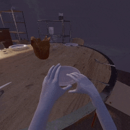
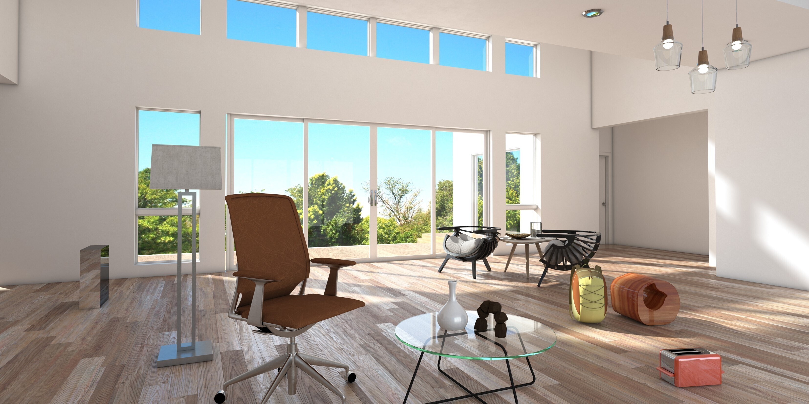

# How to upgrade from TDW v1.11 to v1.12

## Read the changelog

[Read this](../Changelog.md) for a complete list of changes. TDW v1.12 introduces several major features.

## 1. Added Clatter and deprecated PyImpact

Clatter is a major upgrade to PyImpact that is written in C#, as opposed to Python, and included as part of the build, as opposed to the `tdw` Python module. It is faster and more flexible than PyImpact.

**TDW still includes PyImpact in order to support ongoing projects, but PyImpact is deprecated and won't receive further updates.**

To learn more about Clatter, [read this](../lessons/clatter/overview.md).

For a comprehensive comparison between Clatter and PyImpact and upgrade guide, [read this](../lessons/py_impact/py_impact_and_clatter.md).

## 2. Upgraded MacOS graphics API to Metal

Previously, TDW on a Mac Intel computer used the OpenGL graphics API while TDW on a Mac Apple Silicon computer used the Metal graphics API. Because Apple has deprecated OpenGL support, TDW will now use Metal on Mac Intel computers. This won't affect you if you're running TDW on an Apple Silicon CPU and should fix a variety of graphics glitches on Mac Intel computers.

## 3. Added Wheelchair Replicants

Added Wheelchair Replicants, wheelchair-bound and physically-embodied humanoid agents. For more information, [read this](../lessons/wheelchair_replicants/overview.md).

## 4. Added VR hand tracking

The **Oculus Leap Motion** is a VR rig that uses an Oculus headset and a Leap Motion hand tracking sensor:

For more information regarding hardware requirements, installation steps, and user guide for the Oculus Leap Motion, [read this](../lessons/vr/oculus_leap_motion.md).

## 5. Added V-Ray Exporter

With the proper hardware, it is possible to render TDW simulations offline using the V-Ray renderer:

For more information on how to export to V-Ray, including the hardware requirements, [read this](../lessons/photorealism/vray.md).